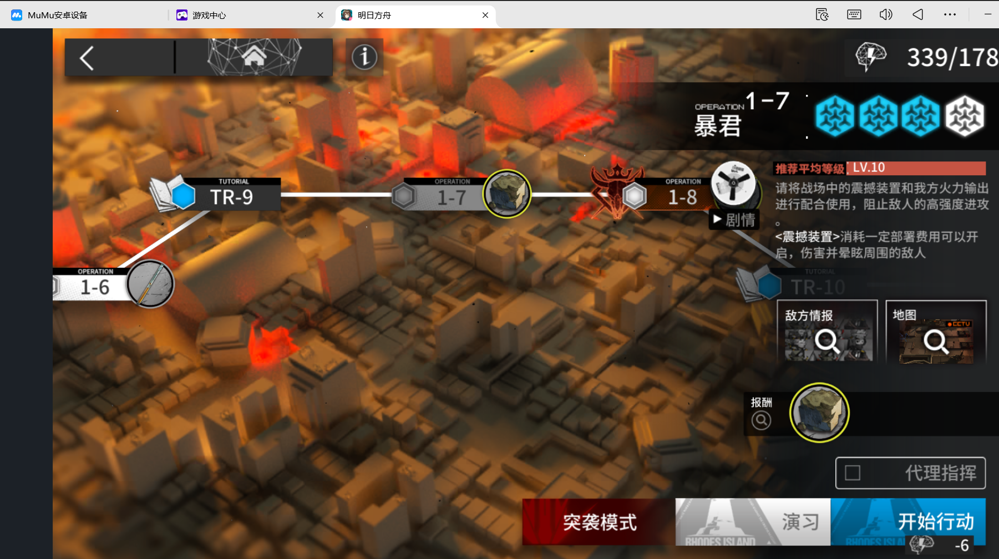
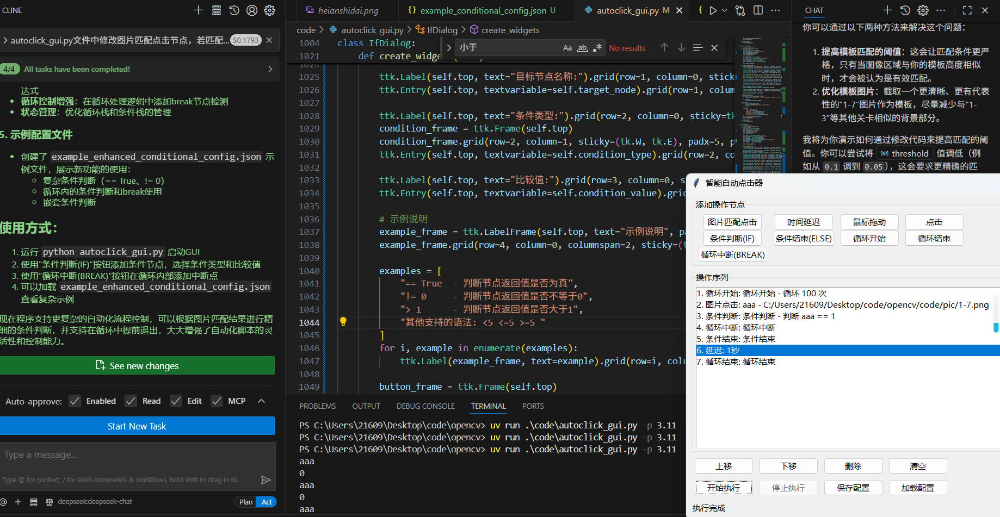
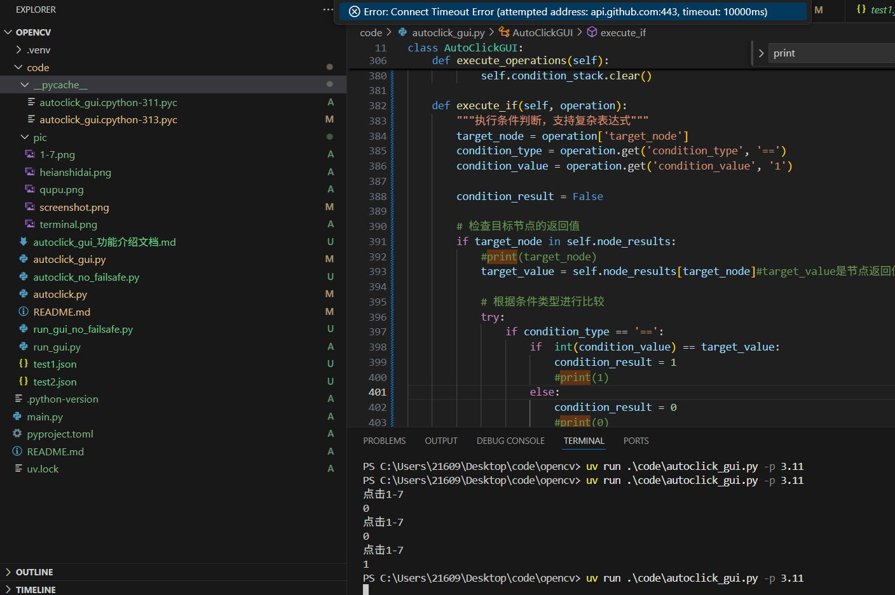
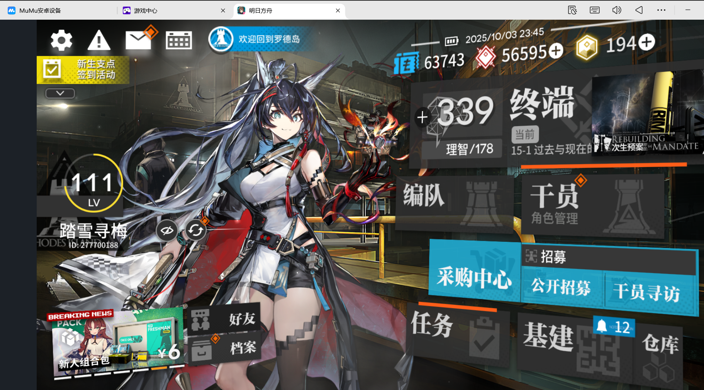
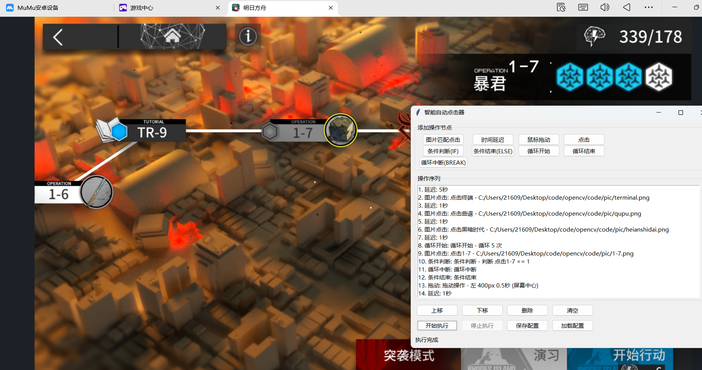

## 1. 环境配置


准备好

vscode

python 3.11 

uv 0.8.13

mumu模拟器 5.7.0 （雷电模拟器无法解决VT问题）

某四字游戏


使用uv作为包管理器

```bash
uv python list
#列出当前的python版本

C:\Users\21609\Desktop\code\opencv> uv init --python 3.11
#初始化当前目录

uv add opencv-python
uv add pyautogui
uv add Pillow
#下载库文件

PS C:\Users\21609\Desktop\code\opencv> uv run .\code\autoclick_gui.py -p 3.11
#运行
```


## 2. 概念验证的测试脚本

脚本来自b站 其神凝

利用opencv和pyautogui实现图像识别+自动操作

https://www.bilibili.com/video/BV1YR4y1G7Ye


```
PS C:\Users\21609\Desktop\code\opencv> uv run .\code\autoclick.py -p 3.11
```


```python
import time
import pyautogui
import cv2
import os

"""
1.点击主屏幕的"终端"二字
2.点击终端中的"曲谱"图标
3.点击黑暗时代
4.点击
"""

def get_xy(img_model_path, threshold=0.1):
    """
    用来判定游戏画面的点击坐标
    :param img_model_path:用来检测的图片
    :param threshold: 匹配阈值
    :return:以元组形式返回检测到的区域中心的坐标, 未找到则返回None
    """
    # 将图片截图并且保存
    pyautogui.screenshot().save("./code/pic/screenshot.png")
    # 待读取图像
    img = cv2.imread("./code/pic/screenshot.png")
    # 图像模板
    img_terminal = cv2.imread(img_model_path)
    if img_terminal is None:
        print(f"错误: 模板图片未找到于 {img_model_path}")
        return None
    # 读取模板的高度宽度和通道数
    height, width, channel = img_terminal.shape
    # 使用matchTemplate进行模板匹配（标准平方差匹配）
    result = cv2.matchTemplate(img, img_terminal, cv2.TM_SQDIFF_NORMED)
    # 解析出匹配区域的左上角图标
    min_val, _, min_loc, _ = cv2.minMaxLoc(result)

    if min_val < threshold:
        upper_left = min_loc
        # 计算出匹配区域右下角图标（左上角坐标加上模板的长宽即可得到）
        lower_right = (upper_left[0] + width, upper_left[1] + height)
        # 计算坐标的平均值并将其返回
        avg = (int((upper_left[0] + lower_right[0]) / 2), int((upper_left[1] + lower_right[1]) / 2))
        return avg
    else:
        return None


def auto_Click(var_avg):
    """
    输入一个元组，自动点击
    :param var_avg: 坐标元组
    :return: None
    """
    pyautogui.click(var_avg[0], var_avg[1], button='left')
    time.sleep(1)


def routine(img_model_path, name):
    avg = get_xy(img_model_path)
    if avg:
        print(f"正在点击{name}")
        auto_Click(avg)
    else:
        print(f"未找到 {name}")
        find_and_click(img_model_path, name)

def find_and_click(img_path, name, max_swipes=5):
    """
    查找并点击一个图片，如果找不到，则向左滑动并重试。
    :param img_path: 要查找的图片路径
    :param name: 图片的名称（用于打印信息）
    :param max_swipes: 最大滑动次数
    """
    img_full_path = img_path
    print(img_full_path)
    for i in range(max_swipes):
        avg = get_xy(img_full_path)
        if avg:
            print(f"已找到并点击 {name}")
            auto_Click(avg)
            return
        else:
            print(f"未找到 {name}，执行第 {i+1} 次滑动...")
            # 假设屏幕中心点可以拖动
            screen_width, screen_height = pyautogui.size()
            drag_start_x = screen_width / 2
            drag_start_y = screen_height / 2
            pyautogui.moveTo(drag_start_x, drag_start_y)
            # 按住并向左拖动
            pyautogui.dragRel(-400, 0, duration=0.5)
            time.sleep(1)  # 等待界面稳定
    print(f"滑动 {max_swipes} 次后仍然未找到 {name}。")


def click_part1():
    """
    1.点击主屏幕的"终端"二字
    2.点击终端中的"曲谱"图标
    4.点击"黑暗时代"字样
    5.拖动鼠标直至找到1-7
    """
    # 点击终端
    routine("./code/pic/terminal.png", "主界面终端")
    # 点击曲谱
    routine("./code/pic/qupu.png", "曲谱")
    # 点击黑暗时代字样
    routine("./code/pic/heianshidai.png", '黑暗时代.png')
    # 点击1-7
    # 若没找到则按住鼠标，向左拖动，然后再次寻找
    routine("./code/pic/1-7.png", '1-7')

time.sleep(5)
click_part1()
```





## 3. 自动点击器GUI版本


```
PS C:\Users\21609\Desktop\code\opencv> uv run .\code\autoclick_gui.py -p 3.11
```





最终版










